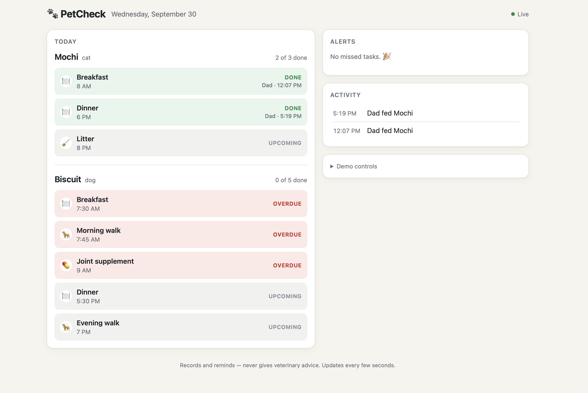

# PetCheck 🐾

**A shared pet care log for Alexa+.** Anyone in the house says "I fed Mochi," and everyone knows it's done.

PetCheck is an **MCP server** (spec 2025-11-25, Streamable HTTP) running on **AWS Lambda**, with
DynamoDB storage, scheduled missed-task alerts, OAuth 2.1 for Alexa+ account linking, a live household
page, and a **simulated Alexa+** web experience that talks to the server through a real MCP client.



## The problem

"Has anyone fed the cat?" gets asked in pet households every day, and the answer is usually a guess.
Pets get fed twice, or they miss a meal or their medication. Hands are full (food bowl, leash, pill
pocket), so opening an app is the last thing anyone does. Voice is the natural place for this.

## What PetCheck does

| Say this | PetCheck does |
|---|---|
| "I fed Mochi" | Logs it for the whole household |
| "I fed Mochi" (Emma, 10 minutes after Dad) | "Dad already fed Mochi at 7:52 AM. Do you want me to log it again?" |
| "Has anyone walked Biscuit?" | What's done today and what's still due or overdue |
| "Mochi threw up this morning" | Records the observation; counts repeats, never interprets them |
| "Book Mochi's checkup next Tuesday at 10" | Schedules the vet visit |
| "How's Mochi doing this week?" | Meals, walks, meds, missed tasks, notes and the next vet visit |
| *(nobody logs dinner)* | 30 min late: household reminder · 60 min late: owner gets an email |

**Safety rule:** PetCheck records and reminds; it **never gives veterinary advice.** Questions about
symptoms, doses, food safety or treatment get "please check with your vet."

## Try it (about 2 minutes, no AWS account needed)

Requires Node 20+.

```bash
npm install
npm run demo
```

Then open **http://localhost:3000/demo** and enter any household key (none is set locally). The left
side is the simulated Alexa+: pick who's speaking (Mom, Dad or Emma), press the mic (Chrome or Safari)
or type, and try:

1. As **Dad**: "I fed Mochi" → logged; the household page on the right updates within seconds.
2. As **Emma**: "I fed Mochi" → "Dad already fed Mochi… log it again?"
3. On the right: **Demo controls → Pretend it's 19:00 → Show → Run missed-task check** → reminders and owner alerts appear.
4. As **Mom**: "How's Mochi doing this week?" → a summary built from a seeded week of history.

The **MCP traffic** panel shows every HTTP request the assistant makes to `/mcp`
(`initialize` → `tools/list` → `tools/call log_care`), with full JSON-RPC bodies.

`npm run demo` uses in-memory data and PetCheck's built-in rules engine, so it runs anywhere.
The deployed version uses DynamoDB and Amazon Bedrock (see below).

## How it works

```
 Simulated Alexa+ (/alexa)          Real Alexa+ (MCP add-on)
 browser speech in/out              OAuth 2.1 account linking
        │ text                               │
        ▼                                    │
 /api/assistant                              │
 Amazon Bedrock (Nova) picks tools           │
 → MCP client ──── Streamable HTTP ──────────┤
                                             ▼
                        PetCheck MCP server  /mcp   (AWS Lambda, stateless)
                        6 tools · API key or OAuth bearer token
                                │
             ┌──────────────────┼────────────────────────┐
             ▼                  ▼                        ▼
      Amazon DynamoDB   EventBridge Scheduler      Household page (/)
      (single table)    every 5 min → missed-task  live view, polls /api/today
                        check → Amazon SNS email
```

- **The MCP server is always in the call chain.** The simulated Alexa+ never touches the data directly:
  its backend is an MCP client ([`src/assistant.ts`](src/assistant.ts)) that connects to `/mcp` over
  HTTPS, lists the tools and calls them, exactly as Alexa+ would.
- **Stateless Streamable HTTP.** A fresh `McpServer` and transport per request, no session IDs, JSON
  responses. Each request loads the household from DynamoDB with one Query, runs the tool, and
  batch-writes only new records, so it runs unchanged on Lambda.
- **Bedrock with a fallback.** The assistant uses Amazon Bedrock (Converse API with tool use, Amazon Nova
  Lite). If the AWS account can't use Bedrock yet, it switches to a rules engine that understands
  PetCheck's phrases and still calls the same MCP tools. The UI labels which engine answered.

### Where the track technology runs (for reviewers)

| File | What it does at runtime |
|---|---|
| [`src/mcp.ts`](src/mcp.ts) | `McpServer` with the 6 tools (`registerTool`, zod schemas, tool annotations) |
| [`src/lambda.ts`](src/lambda.ts) | Lambda entry point: `WebStandardStreamableHTTPServerTransport` on `/mcp` |
| [`src/app.ts`](src/app.ts) / [`src/server.ts`](src/server.ts) | Local server: `StreamableHTTPServerTransport` on `/mcp` |
| [`src/assistant.ts`](src/assistant.ts) | Simulated Alexa+: MCP `Client` + `StreamableHTTPClientTransport` → `/mcp`, Bedrock Converse |
| [`src/oauth.ts`](src/oauth.ts) | OAuth 2.1 for Alexa+: client credentials (`mcp:service`) and authorization code + PKCE (`mcp:tools`) |

## MCP tools

| Tool | Purpose |
|---|---|
| `add_pet` | Add a pet and its daily routine |
| `log_care` | Log feed / walk / meds / litter / water / groom; asks before logging a duplicate within 30 min |
| `get_status` | Today's done / due / overdue tasks (read-only) |
| `add_note` | Record an observation |
| `add_vet_visit` | Schedule a vet appointment |
| `weekly_summary` | 7-day summary (read-only) |

Details that came from real use:

- **Logs match the right task.** A log counts toward the nearest task that's already due (or due within
  the hour), so a 2:48 PM feeding with breakfast missed is a late breakfast, and a 5:30 PM feeding is the
  6 PM dinner.
- **Forgiving names.** Speech recognition hears "Mochi" as "Machi" or "Mochie", so names match within a
  small edit distance, and "the cat" or "the dog" means the household's only cat or dog. Anything further
  off gets "I don't know a pet called Monkey. I know Mochi and Biscuit" rather than a wrong log.
- **Spoken-friendly results.** Every tool returns a sentence Alexa can read as-is, plus structured content.

## Missed-task alerts

EventBridge Scheduler invokes the Lambda every 5 minutes. For each routine task still not logged:

| How late | Alert | Who hears about it |
|---|---|---|
| 30 min | household reminder | household page (and Alexa) |
| 60 min | owner alert | emailed to the owner via Amazon SNS |

Each alert is raised once and stored in DynamoDB; logging the task marks it resolved. Tasks more than
3 hours late are skipped, which also prevents an alert flood after downtime.


## Alexa+ add-on readiness

PetCheck meets the Alexa+ MCP Toolkit requirements we could implement ourselves:

- Streamable HTTP (2025-11-25), public HTTPS URL, warm tool calls in roughly 100–200 ms
- **OAuth 2.1:** metadata at `/.well-known/oauth-authorization-server`; `client_credentials` → `mcp:service`
  (can list tools but is refused household data with 403 `insufficient_scope`); authorization code + PKCE
  S256 → `mcp:tools` for the linked household; tokens expire in ≤ 3600 s; no refresh token for client
  credentials; RFC 6749 error responses; unauthenticated requests get 401 without `WWW-Authenticate`
- Account-linking page where the owner enters the household key
- Listing materials in [`alexa/`](alexa/): icons in all 6 sizes, a 600×900 carousel image, descriptions
  and example phrases ([`alexa/listing.md`](alexa/listing.md), checked by `npm run check:listing`),
  plus [privacy policy](src/privacy.html) and [terms](src/terms.html) pages served at `/privacy` and `/terms`

**Region / access note:** this project is built in the US, where Alexa+ is available. Installing the
`alexa-ai` CLI requires assuming an Amazon developer-tools role, and that role doesn't yet trust our AWS
account (AccessDenied, documented in [FRICTION_LOG.md](FRICTION_LOG.md) FL-008), so the add-on couldn't
be registered with real Alexa+ before the deadline. As the rules allow, the demo uses the **simulated
Alexa+** web experience, which calls the same deployed MCP server through a real MCP client. Once access
is granted, `alexa-ai new mcp --mcp-server-url <url>/mcp` plus the materials in `alexa/` is all that's left.

## AWS services used

| Service | How PetCheck uses it |
|---|---|
| **AWS Lambda** | Hosts the MCP server, household API, pages and OAuth endpoints behind an HTTPS Function URL |
| **Amazon DynamoDB** | Single-table storage for pets, care logs, notes, vet visits and alerts (free-tier capacity) |
| **Amazon EventBridge Scheduler** | Invokes the Lambda every 5 minutes for the missed-task check |
| **Amazon SNS** | Emails the owner when a task is an hour overdue |
| **Amazon Bedrock** | Converse API with tool use (Amazon Nova Lite) for the simulated Alexa+; automatic fallback while account access is pending (FL-006) |
| **AWS IAM** | Least privilege: Lambda may only touch the `petcheck` table, the alert topic and Bedrock invoke; the scheduler may only invoke the function |

## Deploy to AWS

Requires the AWS CLI configured (`aws configure`, region `us-east-1`).

```bash
npm run db:create   # one-time: DynamoDB table
npm run db:reset    # demo data: Mochi, Biscuit and last week's history
npm run deploy      # Lambda + Function URL + 5-min schedule + OAuth secrets (+ SNS if ALERT_EMAIL is set)
```

`npm run deploy` is idempotent: the first run creates everything, later runs update the code. It prints
the URLs and runs a smoke test (health, `tools/list`, an OAuth client-credentials token, a missed-task
check). Secrets (API key, OAuth client secret and signing key) are generated once into `.env.deploy`,
which is git-ignored. Add `ALERT_EMAIL=you@example.com` there for owner emails.

| Path | What |
|---|---|
| `/` | Household page |
| `/alexa` | Simulated Alexa+ |
| `/demo` | Split screen: simulated Alexa+ and the household page, for recording |
| `/mcp` | MCP endpoint (household key via `x-api-key` / `Authorization: Bearer`, or an OAuth token) |
| `/api/today`, `/api/check-missed`, `/api/assistant` | JSON API used by the pages |
| `/.well-known/oauth-authorization-server`, `/oauth/authorize`, `/oauth/token` | OAuth 2.1 for Alexa+ |
| `/privacy`, `/terms`, `/health` | Listing pages and a health check |

Other commands: `npm run logs` (follow the Lambda logs), `npm run db:status`, `npm run dev:dynamo`
(local server against DynamoDB), `npm run inspector` (MCP Inspector; connect with Streamable HTTP to
`http://localhost:3000/mcp`).

## Tests

```bash
npm run smoke           # tool logic: duplicate check, status, notes, summary
npm run test:alerts     # missed-task alerts and task matching with a simulated clock
npm run test:storage    # persistence with a fake database, incl. Lambda cold starts between requests
npm run test:lambda     # the Lambda handler with Function URL events, incl. OAuth flows
npm run test:oauth      # OAuth 2.1 as Alexa+ runs it, plus negative cases
npm run test:assistant  # assistant → real MCP client → HTTP → real server; Bedrock-blocked fallback
npm run test:rules      # the rules engine's phrase understanding
npm run check:listing   # Alexa+ listing limits and image sizes
```

## Friction log

Eight entries, written as things happened: [FRICTION_LOG.md](FRICTION_LOG.md). Highlights: the MCP SDK's
Node transport fails behind serverless-http on Lambda (FL-005), new accounts are blocked from Bedrock
with a misleading `ValidationException` (FL-006), speech recognition mangles pet names (FL-007), and the
Alexa+ MCP Toolkit setup gives AccessDenied with no documented way to request access (FL-008).

## License

[MIT](LICENSE)
