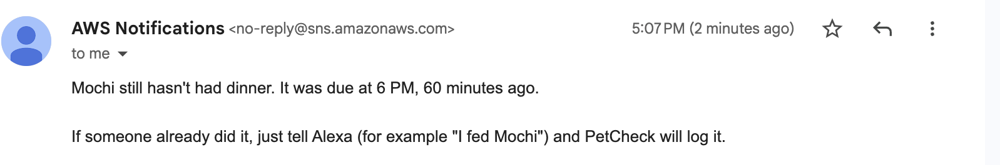

# PetCheck 🐾

**A shared pet care log for Alexa+.** Anyone in the house says "I fed Mochi," and everyone knows it's done.

> Built for the Amazon Alexa+ track. PetCheck is an MCP server (spec 2025-11-25, Streamable HTTP)
> that any Alexa+ device can call.

## The problem

"Has anyone fed the cat?" gets asked in pet households every day, and the answer is usually a guess.
Pets get fed twice, or they miss a meal or their medication.

## What PetCheck does

| Say this | PetCheck does |
|---|---|
| "I fed Mochi" | Logs it for the whole household |
| "I fed Mochi" (again, 10 minutes later) | "Dad already fed Mochi at 7:52 AM. Log it again?" |
| "Has anyone walked Biscuit?" | Shows what's done today and what's still due |
| "Mochi threw up this morning" | Records the observation (never interprets it) |
| "Vet checkup next Tuesday at 10" | Schedules it and reminds you the day before |
| "How's Mochi doing this week?" | Summarizes meals, walks, meds, missed tasks, notes and the next vet visit |

## Safety rule

PetCheck **records and reminds; it never gives veterinary advice.** Questions about symptoms, doses,
food safety or treatment get "please check with your vet." Repeated observations are counted,
never interpreted.

## MCP tools

| Tool | Purpose |
|---|---|
| `add_pet` | Add a pet and its daily routine |
| `log_care` | Log feed / walk / meds / litter / water / groom; asks before logging a duplicate within 30 min |
| `get_status` | Today's done / due / overdue tasks (read-only) |
| `add_note` | Record an observation |
| `add_vet_visit` | Schedule a vet appointment |
| `weekly_summary` | 7-day summary (read-only) |

## Architecture

```
Simulated Alexa+ page (Web Speech API)
        │ voice → text
        ▼
Backend: LLM (Amazon Bedrock) + MCP client
        │ Streamable HTTP
        ▼
PetCheck MCP server (TypeScript, stateless)  ── AWS Lambda
        ├── DynamoDB (pets, care events, notes, vet visits)
        └── EventBridge Scheduler → missed-task check → household page
```

The server runs in **stateless** Streamable HTTP mode (no session IDs), so it can run on Lambda with all
state kept in the data store.

## Run it locally

Requires Node 20+.

```bash
npm install
npm run smoke         # logic checks, no server needed
npm run test:storage  # persistence checks with a fake database
npm run test:alerts   # missed-task alert logic with a simulated clock
npm run test:lambda   # the Lambda handler with fake Function URL events
npm run dev        # starts http://localhost:3000/mcp (with demo pets Mochi and Biscuit)
```

Test with MCP Inspector in a second terminal:

```bash
npm run inspector
```

In the Inspector: **Transport Type** = Streamable HTTP, **URL** = `http://localhost:3000/mcp`, click **Connect**,
then **Tools → List Tools**.

Environment variables: `PORT` (default 3000), `HOUSEHOLD_TZ` (default `America/Detroit`),
`SEED=false` to start with no demo pets.

### Storage: memory or DynamoDB

By default data lives in memory (resets on restart). To use DynamoDB (requires `aws configure`):

```bash
npm run db:create     # one-time: creates the "petcheck" table (free-tier capacity)
npm run db:reset      # load fresh demo data (Mochi, Biscuit, last week's history)
npm run dev:dynamo    # run the server against DynamoDB
npm run db:status     # see what's stored
```

Single-table design: `pk = HH#<household>`, `sk = PET#… | EVT#<time>#… | NOTE#<time>#… | VET#<date>#…`.
Each request loads the household with one Query, runs the same logic, and batch-writes new records.
The server holds no state between requests, so it runs unchanged on AWS Lambda.

Extra variables: `STORAGE=dynamodb`, `TABLE_NAME` (default `petcheck`), `HOUSEHOLD_ID` (default `demo`),
`AWS_REGION` (default `us-east-1`).

## Household page

Open the Lambda URL (or `http://localhost:3000/` in dev) in any browser and enter the household key once.
It shows each pet's routine for today (done / due / overdue), alerts, and a live activity feed that
refreshes every few seconds, so a task logged by voice appears within moments. On a phone, alerts come first.

Demo controls (bottom right): "Pretend it's 6:30 PM" and **Run missed-task check** run the real alert
logic at a simulated time. Tip: open `<url>/?time=18:30#key=<key>` to preload both.



## Missed-task alerts

Every 5 minutes EventBridge Scheduler runs the check. For each routine task still not logged:

| How late | Alert | Who hears about it |
|---|---|---|
| 30 min | `household` reminder | shown on the household page (and can be spoken by Alexa) |
| 60 min | `owner` alert | emailed to the owner via SNS |

Each alert is raised once and stored in DynamoDB; logging the task marks its alerts resolved.
Tasks more than 3 hours late are skipped (the scheduler already caught them).
Logged tasks count toward the *nearest* scheduled slot, so a 7 PM feeding is dinner even if breakfast was missed.

Demo: pretend it's a given time today and run the real check:

```bash
source .env.deploy
curl -X POST "$URL/api/check-missed" -H "x-api-key: $API_KEY" -H "content-type: application/json" -d '{"time":"18:30"}'
curl "$URL/api/today?time=18:30" -H "x-api-key: $API_KEY"
```

## Deploy to AWS

```bash
npm run deploy   # Lambda + Function URL + 5-minute schedule (+ SNS email if ALERT_EMAIL is in .env.deploy)
npm run logs     # follow the Lambda logs
```

## AWS services used

| Service | How PetCheck uses it |
|---|---|
| **Amazon DynamoDB** | Stores pets, care logs, notes and vet visits (single table, provisioned within free tier) |
| **AWS Lambda** | Hosts the MCP server behind a public HTTPS Function URL (API-key protected), plus the household API |
| **Amazon EventBridge Scheduler** | Invokes the Lambda every 5 minutes to check for overdue pet care tasks |
| **Amazon SNS** | Emails the owner when a task is an hour overdue (optional, `ALERT_EMAIL`) |
| AWS IAM | Least-privilege roles: Lambda may only touch the `petcheck` table and alert topic; the scheduler may only invoke the function |
| Amazon Bedrock | _next: LLM for the simulated Alexa+ page_ |

## Region note

_TODO: explain simulated Alexa+ path vs. real device testing._

## Friction log

See [FRICTION_LOG.md](FRICTION_LOG.md).

## License

_TODO: add an open-source license before making the repo public._
